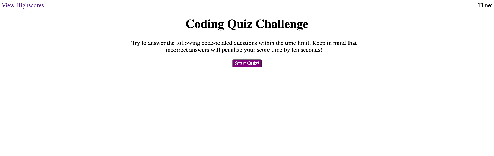

# The-Coding-Quiz-Challenge

## Table of Contents
* [Introduction](#introduction)
* [Usage](#usage)
* [Credits](#credits)
* [Losing Streak](#losingstreak)
* [License](#license)

## Introduction

How well do you know your code? Better than me, I hope! This week, I was tasked with creating a quiz to test the knowledge of newly hired software developers. The quiz is designed to weed out the novices by grilling them on the basics of coding. An essential part of the interview process for developers and engineers is cracking coding tests that are designed to fry the minds and spirits of potential recruits. Though the test material is often not seen in projects a developer may be given once hired, it's important to pluck the brightest bulbs from the bunch to ensure the vacant position is filled by someone who can handle the rigor of the job. As a professional coder, this person should be knowledgable, dilligent, and repsonsible for producing spotless code. Otherwise, just anyone could be in charge of a piece of technology that has the potential to make or break a company.

## Usage

To view this website, please [click here](https://aikeh2021.github.io/The-Coding-Quiz-Challenge/). 

To view the code used to build this website, [click here](https://github.com/Aikeh2021/The-Coding-Quiz-Challenge).

## Credits

* [Aligning Elements](https://www.w3schools.com/css/css_align.asp)
* [Positioning Text In A Document](https://www.w3schools.com/css/css_positioning.asp)
* [Removing Underline Decoration](https://www.w3schools.com/cssref/pr_text_text-decoration.asp)
* [Kinds of Lists](https://www.w3schools.com/html/html_lists.asp)
* [Explanation of the Javascript Not A Function Error](https://developer.mozilla.org/en-US/docs/Web/JavaScript/Reference/Errors/Not_a_function)
* [How To Use Query Selector All](https://developer.mozilla.org/en-US/docs/Web/API/Document/querySelectorAll)

## Losing Streak

I think it's safe to say my streak has begun. Looking back on where things went wrong, I believe I lacked a sense of urgency when realizing that I wasn't understanding the material covered when Javascript was introduced in unit 3. I thought that like the previous two units, I would understand eventually. It wasn't until I tanked the third assignment, and saw that each unit built on the one prior, that I realized that in order to do better, I would have to start from where my comprehension deviated.
Although I was making some progress trying to review one lecture a day, it was very time consuming and mentally draining. 
I had to ask myself, how did I keep letting my motivation dwindle until it was too late to make real progress on my homework assignments?
I don't have an answer to that question, but I have one last solution to try to affect positive change in my class performance. Maybe if my new method works, I'll reflect on the positive changes I've seen in the next assingment. Hopefully I'll get back into the habit of submitting completed websites. Until then, this is all I have to offer.
I will be revisiting the assignment once I have finished reviewing the lectures in unit 4. I may not understand now, but I will soon.

## License

MIT License

Copyright © 2020 Ashley Ikeh

Permission is hereby granted, free of charge, to any person obtaining a copy
of this software and associated documentation files (the "Software"), to deal
in the Software without restriction, including without limitation the rights
to use, copy, modify, merge, publish, distribute, sublicense, and/or sell
copies of the Software, and to permit persons to whom the Software is
furnished to do so, subject to the following conditions:

The above copyright notice and this permission notice shall be included in all
copies or substantial portions of the Software.

THE SOFTWARE IS PROVIDED "AS IS", WITHOUT WARRANTY OF ANY KIND, EXPRESS OR
IMPLIED, INCLUDING BUT NOT LIMITED TO THE WARRANTIES OF MERCHANTABILITY,
FITNESS FOR A PARTICULAR PURPOSE AND NONINFRINGEMENT. IN NO EVENT SHALL THE
AUTHORS OR COPYRIGHT HOLDERS BE LIABLE FOR ANY CLAIM, DAMAGES OR OTHER
LIABILITY, WHETHER IN AN ACTION OF CONTRACT, TORT OR OTHERWISE, ARISING FROM,
OUT OF OR IN CONNECTION WITH THE SOFTWARE OR THE USE OR OTHER DEALINGS IN THE
SOFTWARE.